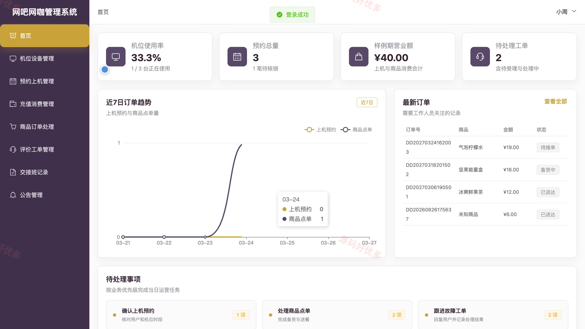
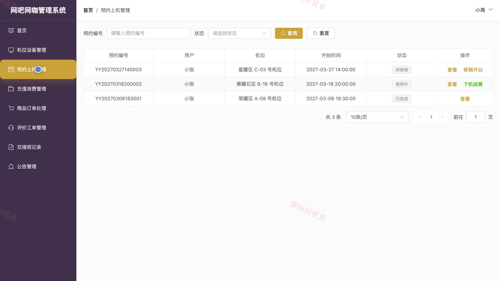
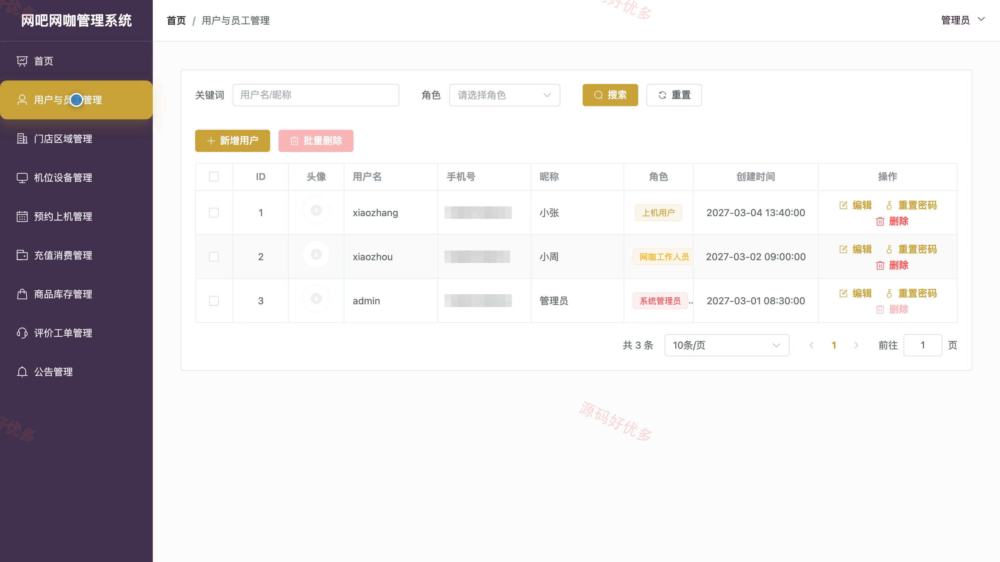
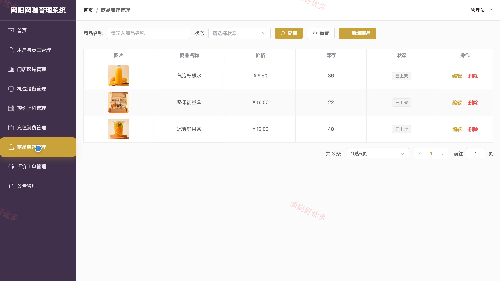

# bs074A
bs074A网吧网咖管理系统
## 源码问题查看主页咨询

### 一、关键词
网吧管理、网咖运营、机位预约、会员充值、商品点单

### 二、作品包含
源码+数据库+万字设计文档+PPT+全套环境和工具资源+本地部署教程

### 三、项目技术
前端技术： Html、Css、Js、Vue3.4、Element-Plus
后端技术：Java、SpringBoot3.2.0、MyBatis-Plus

### 四、运行环境（以下版本亲测，其他版本兼容性请自行测试）
开发工具：IDEA/eclipse + VSCODE

数据库：MySQL5.7+（共16张表）

数据库管理工具：Navicat10以上版本

环境配置软件： JDK17 + Maven

前端Nodejs：16+

浏览器：谷歌浏览器

### 五、项目介绍
项目编号：bs074A

该系统围绕网咖门店日常运营建立统一业务入口，面向上机用户提供机位预约、商品点单、余额消费、故障报修与评价反馈服务；面向网咖工作人员提供机位、预约、充值消费、商品订单、评价工单、交接班和公告处理；面向系统管理员提供用户员工、门店区域、机位预约、充值消费、商品库存、评价工单与公告的综合管理。

角色：上机用户、网咖工作人员、系统管理员

上机用户功能：账号注册登录与资料维护、公告查看、机位查询与预约、预约记录管理、商品点单、余额与消费查询、故障报修、评价反馈。

网咖工作人员功能：后台登录、机位设备管理、预约上机管理、充值消费管理、商品订单处理、评价工单管理、交接班记录、公告管理。

系统管理员功能：后台登录、用户与员工管理、门店区域管理、机位设备管理、预约上机管理、充值消费管理、商品库存管理、评价工单与公告管理。

### 六、运行截图

